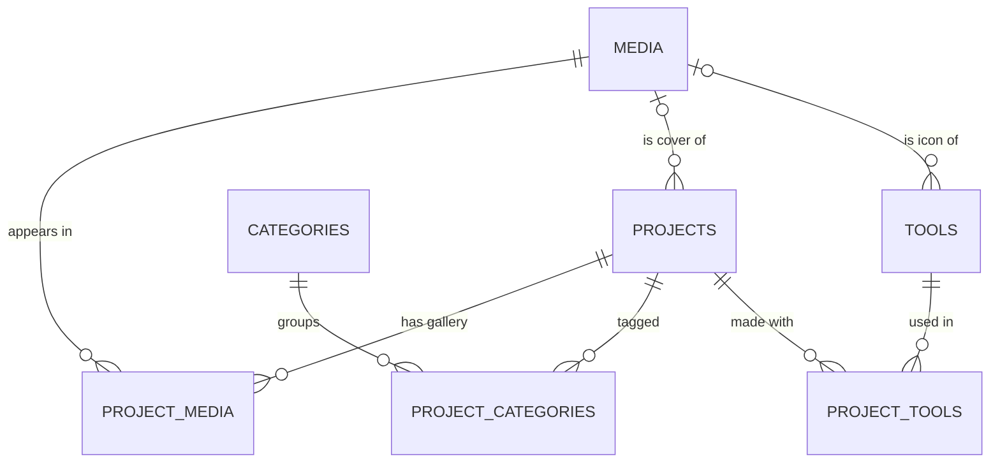

# PRD — Dani Setiadi Portfolio & Profile Website (with Admin Dashboard)

| | |
|---|---|
| **Document** | Product Requirements Document (PRD) |
| **Product** | Personal portfolio & profile website for **Dani Setiadi** (Graphic Designer & Illustrator) + an admin dashboard to manage all content |
| **Version / status** | v1.0 — Draft for review |
| **Date** | 11 September 2026 |
| **Prepared by** | M.J Fird |
| **Admin / content owner** | Dani Setiadi |
| **Visual source of truth** | The "01/ CV" design — save it in the repo as `docs/reference/cv-reference.jpg` |

> **How to read this document**
> - **Humans:** §1–§4 explain *what* and *why*; §5 is the brand system; §7–§9 are the detailed specs; §13 is the build plan.
> - **AI coding agents (Claude Code, Cursor, etc.):** read the whole document before writing code, build strictly in the phase order of §13.2, and cite requirement IDs (e.g. `WORK-07`) in commits and progress reports.
> - **Priorities:** **P0** = must ship at launch · **P1** = fast follow · **P2** = future (design for it, don't build it).

---

## 1. Summary

A fast, single-page portfolio (plus project pages) that looks like Dani's CV design come to life: a warm cream canvas, one loud signal-orange accent, navy ink, oversized tightly-tracked grotesque type, a handwritten "Hi, I'm" greeting layered over a portrait, and outlined pill elements.

Everything a visitor can see — copy, images, videos, portfolio items, their order, availability status — is editable from a private admin dashboard at `/admin`. Every image slot accepts three sources: **upload a file**, **paste an image link**, or (where it makes sense) **paste a YouTube link**.

The portfolio is presented as **editorial "Featured" rows + a masonry gallery** that preserves each artwork's native aspect ratio (decision and reasoning in §7.3.1). Recommended stack: **Next.js + Supabase + Vercel** (§11).

---

## 2. Problem statement

Dani is a graphic designer and illustrator with ~10 years of experience: brand identities, logos and Instagram visuals for sneaker brands, streetwear labels and coffee shops, plus custom characters and mascots. He is open to remote and full-time roles and to client work.

His current profile is a static CV design (the reference image). A static file can't show the breadth of his work (brand systems, social content, mascots, motion/video), can't be updated without re-designing and re-exporting it, and gives visitors no direct path to contact him. Portfolios that are hard to update go stale — and prospects judge a designer by their most recent work, so a stale or hard-to-browse portfolio quietly costs interviews and client projects.

---

## 3. Goals and non-goals

### 3.1 Goals

| # | Goal (outcome) | How we know it worked |
|---|---|---|
| G1 | **Brand-faithful first impression** — the site is unmistakably Dani's identity | At 1440 px and 390 px widths, the hero and About chapters match the reference's layout, palette and type hierarchy; Dani signs off in design QA |
| G2 | **Self-service content** — Dani updates everything without a developer | New project published in ≤ 3 min; any copy change in ≤ 1 min; changes live on the site in ≤ 10 s |
| G3 | **Any media, reliably** — upload, image link or YouTube in every relevant slot | 100 % of the media test matrix (§14.2) passes; zero broken images on the public site |
| G4 | **Turn visits into conversations** | A contact path (WhatsApp / email / CV) is never more than one scroll or tap away; CTA clicks are tracked |
| G5 | **Fast and accessible** | Lighthouse mobile ≥ 90 Performance, ≥ 95 Accessibility & SEO; Core Web Vitals "good" |

### 3.2 Non-goals (v1)

| Non-goal | Why it's out of scope |
|---|---|
| Blog / articles | No content pipeline yet; the rich-text + media system can power it later |
| Shop, print sales, payments | A separate business initiative with payment and legal scope |
| Bilingual EN / ID | The reference and the target audience (remote roles) are English; the data model leaves room for it (P2) |
| Free-form page builder | Unlimited layouts would let edits break the design; v1 offers controlled editing inside the brand system |
| Multiple roles / client portal | One owner plus one maintainer account is enough |
| Dark mode | The cream canvas is a core brand asset |

---

## 4. Users and user stories

### 4.1 Personas

| Persona | What they need | Converts via |
|---|---|---|
| **Brand owner / marketing lead** (sneaker, streetwear, coffee shop, F&B) | See relevant work fast, judge style fit, contact quickly — WhatsApp is the default channel in Indonesia | WhatsApp, email |
| **Recruiter / creative lead** (remote or full-time) | Availability, experience, tools, a downloadable CV | Download CV, email |
| **Agency / collaborator** | Range and depth: case studies, video, character work | Project pages, email |
| **Admin — Dani** | Non-developer; updates from laptop *and* phone; wants drag-and-drop simplicity and guardrails so edits can't break the design | Dashboard |

### 4.2 User stories (priority order)

**Visitors**
1. As a brand owner, I want to filter the portfolio by the kind of work I need (logo, Instagram visuals, mascot…) so that I can judge fit in under a minute.
2. As a brand owner, I want to see the full, uncropped artwork and play videos without leaving the page so that I can evaluate quality.
3. As a recruiter, I want availability, experience and tools at a glance plus a CV PDF so that I can shortlist Dani quickly.
4. As any visitor, I want one-tap contact from anywhere on the site so that starting a conversation is effortless.
5. As a mobile visitor on 4G, I want the site to load fast and read well on my phone so that I don't bounce.

**Admin (Dani)**

6. As Dani, I want to add work by dropping files, pasting an image link, or pasting a YouTube link so that I can publish work wherever it lives.
7. As Dani, I want to reorder, feature, hide and categorize projects so that the portfolio tells the story I choose.
8. As Dani, I want to edit every headline, paragraph, button label and image so that I never need a developer for content changes.
9. As Dani, I want to switch my "Open for work" status and caption in one tap so that my availability is always accurate.
10. As Dani, I want guardrails — character counters, required alt text, clear errors — so that my edits never break the layout.
11. As Dani, I want to post new work from my phone right after finishing it.

**Edge cases**

12. As Dani, when I paste a link that isn't a direct image (e.g. an Instagram post page), I want a clear message telling me how to fix it.
13. As Dani, if an image link I used later stops working, I want the dashboard to flag it (P2) — and visitors must never see a broken-image icon (P0).
14. As a visitor, if the portfolio or a category is empty, I see a sensible state, not a blank hole.

---

## 5. Brand identity and design system

All colour values were **sampled directly from the reference image** (its embedded profile is sRGB, so the values are web-ready). Tokens marked *derived* were computed from the sampled palette to meet accessibility or UI needs. The reference is the source of truth for look and feel; this section translates it into web tokens and rules.

### 5.1 Personality, voice and principles

- **Personality:** confident, friendly, street-savvy, precise.
- **Voice:** short, first-person, conversational English ("Hi, I'm…", "Let's Connect"). Sentence case in the UI. Uppercase only where the reference uses it (the availability pill, company names).
- **Principles**
  1. **Scale contrast is the hero.** Oversized, tightly tracked type against generous cream space. Boldness is spent on the hero name and chapter headings; everything else stays quiet.
  2. **One loud colour.** Signal Orange is the only accent. Navy does the reading; orange does the shouting.
  3. **Human touch.** The handwritten greeting and the portrait carry the warmth — no gradients, patterns or stickers competing with them.
  4. **Let the work breathe.** Artwork is shown uncropped in its native ratio wherever possible; UI chrome stays minimal so the portfolio carries the colour.

### 5.2 Colour tokens

| Token | Hex | Source | Usage | Contrast on Cream |
|---|---|---|---|---|
| `cream` | `#F5EFE3` | Sampled — page background (perfectly flat across the reference) | Page background; text on Ember | — |
| `signal` | `#F65117` | Sampled — "Dani Setiadi", "Connect", pills, bullets, pin icon | Name, keyword lines, pill outlines, bullets, icons, large labels | **3.00 : 1** → large text & UI outlines only |
| `ink` | `#13182B` | Sampled — "Let's", "Experience", "Tools", script greeting | Headings, greeting, strong text, labels on orange | 15.37 : 1 ✅ |
| `body` | `#424242` | Sampled — bio and description text | Paragraphs, descriptions | 8.78 : 1 ✅ |
| `ember` | `#BB3607` | *Derived* — Signal's hue darkened until it clears AA | Small orange text, active nav link, primary-button hover fill | 5.03 : 1 ✅ |
| `muted` | `#666666` | *Derived* | Dates, captions, secondary meta | 5.01 : 1 ✅ |
| `surface` | `#EEE9DD` | *Derived* — Cream + 3 % Ink | Image placeholders, skeletons, subtle admin panels | — |
| `signal-tint` | `#F5E2D3` | *Derived* — Cream + 8 % Signal | Hover fill for outline chips and buttons | Ink on it: 14.0 : 1 ✅ |
| `line` | `#DAD5CD` | *Derived* — Cream + 12 % Ink | Dividers, input borders (decorative) | — |

**Hard contrast rules (WCAG 2.2 AA)**
1. Signal text on Cream is allowed only at **≥ 24 px regular or ≥ 19 px bold** (large text). Anything smaller in orange uses **Ember**.
2. Filled Signal elements with small labels (chips, standard buttons) use **Ink** labels (5.12 : 1). Never Cream or white on Signal at small sizes (3.00 : 1 and 3.44 : 1 both fail).
3. Large bold labels on Signal (e.g. the OPEN FOR WORK pill in its hover state) may use Cream.
4. Focus ring everywhere: 2 px Ink outline with a 3 px offset — visible on Cream and on Signal.

> The reference uses pure black for company names/role lines and `#27262B` for the header meta. The web unifies these to **Ink** for cohesion; the difference is invisible at those sizes.

### 5.3 Typography

**What the reference uses (by eye):** display and UI text in an SF-Pro/Inter-style neo-grotesque with very tight tracking; company names and years in a wider geometric caps face (Avenir-Next-like); body in a neutral sans; the greeting in a monoline signature script.

**Licensing:** if the reference was set in macOS system fonts (SF Pro, Avenir Next), their licenses don't allow general web embedding. Use these open-license (OFL) equivalents, self-hosted through `next/font` (no layout shift, no third-party font requests):

| Role | Web typeface | Weights | Why this choice |
|---|---|---|---|
| Display & headings | **Inter Tight** | 600, 700, 800 | Closest open match to the reference grotesque; drawn for tight display setting |
| Body & UI | **Inter** | 400, 500, 600 | Same skeleton as the display face → cohesive; excellent on screens |
| Caps labels (company names, years) | **Inter Tight 700**, uppercase, +0.04em | — | Fewer families = faster. *Fidelity option:* Nunito Sans 800 is closer to the Avenir-style caps |
| Greeting | **SVG lettering** (preferred). Fallback font: *Herr Von Muellerhoff* or *Ms Madi* | — | No font reproduces the custom long crossbar; SVG keeps it exact and animatable |

**Type scale.** Sizes use container-query units (`cqi`) inside the page container (max 1440 px), so display type scales with the layout rather than the raw viewport. Ratios were measured from the reference: the name's cap height is 11.8 % of the canvas width, and "Connect" is about half the name's size.

| Token | Reference element | Face / weight | Size | Line height | Tracking |
|---|---|---|---|---|---|
| `display-name` | "Dani Setiadi" | Inter Tight 800 | `clamp(3.25rem, 16cqi, 14.5rem)` | 0.82 | -0.055em |
| `display-xl` | "Connect" (keyword line) | Inter Tight 700 | `clamp(3rem, 8.2cqi, 7.5rem)` | 0.9 | -0.05em |
| `display-l` | "Let's" (lead line) | Inter Tight 700 | `clamp(2.25rem, 5.4cqi, 5rem)` | 0.95 | -0.045em |
| `h2` | "Experience" | Inter Tight 700 | `clamp(2rem, 4cqi, 3.75rem)` | 1.0 | -0.045em |
| `h3` | "Tools", large contact links | Inter Tight 700 | `clamp(1.5rem, 2.8cqi, 2.75rem)` | 1.05 | -0.04em |
| `pill-xl` | "OPEN FOR WORK" | Inter Tight 800, uppercase | `clamp(1.25rem, 2.2cqi, 2.125rem)` | 1 | -0.04em |
| `label-caps` | "SHOES AND CARE SMG" | Inter Tight 700, uppercase | `clamp(1rem, 1.35cqi, 1.25rem)` | 1.2 | +0.04em |
| `label-year` | "2019–2023" | Inter Tight 700 | same as `label-caps` | 1.2 | +0.12em |
| `lead` | Bio paragraph | Inter 400 (bold = Inter 600 in Ink) | `clamp(1.0625rem, 0.9rem + 0.6cqi, 1.5rem)` | 1.7 | 0 |
| `body` | Descriptions | Inter 400 | `1rem` → `1.0625rem` | 1.75 | 0 |
| `meta` | Roles, captions | Inter 400 / 500 | `0.875rem` → `0.9375rem` | 1.5 | 0 |
| `index` | "01/ CV" | Inter 300 | `clamp(1rem, 1.4cqi, 1.375rem)` | 1 | 0 |
| `card-title` | Portfolio card title | Inter Tight 600 | `1.125rem` → `1.25rem` | 1.2 | -0.02em |

Rules: body line length 60–65 characters max; exactly one `h1` per page; typographic apostrophes (’) in all copy — "Let’s", "I’m".

### 5.4 Signature elements (brand rules)

| Element | In the reference | Rule on the web |
|---|---|---|
| **Two-tone headline** | "Let’s" (Ink) over "Connect" (Signal); "Hi, i'm" over "Dani Setiadi" | A quiet lead line in Ink stacked tight over a loud keyword line in Signal. Reserved for *chapter* headings only (Hero, Work, About, Contact, "Next project"). Secondary headings ("Experience", "Tools") stay single-colour Ink, exactly as in the reference. In the CMS, every chapter heading is two fields: `lead` + `keyword`. |
| **Type over portrait** | The name sits in front of the portrait's lower third | Stacking order: portrait (z1) → name (z2) → greeting (z3). |
| **Handwritten greeting** | Ink script crossing into the name; the "H" crossbar runs off the left edge | The greeting overlaps the name's top-left by ~15 % of its cap height; its crossbar extends to the viewport's left edge (outside the container). |
| **Outlined pill** | OPEN FOR WORK, Tools | 3 px Signal stroke (2 px on mobile), full radius. Used for status, groupings, filters and secondary buttons — never as decoration. |
| **Orange dot bullet** | Experience entries | Signal circle, 14 px mobile / 18 px desktop, aligned to the first text line. Used for timelines and meta lists. |
| **Index label** | "01/ CV" | `index` style, top-left of each chapter. It encodes position (it matches the nav), so the numbers are generated automatically from the visible chapter order. The same style powers the lightbox counter ("03/24"). |
| **Right-aligned years** | "2019-2023" at the right edge of each entry | Dates align right (Experience, portfolio cards, featured rows). |
| **Frameless portrait** | The photo background equals the page cream; a very soft shadow (max ~5 % darker) sits to its left | No visible box or seam around the portrait. All other media: square corners, no shadow. |

### 5.5 Layout, spacing and shape

| Token | Value | Notes |
|---|---|---|
| `container-max` | 1440 px | `container-type: inline-size` on the page wrapper (enables `cqi`) |
| `gutter` | `clamp(1.25rem, 4cqi, 4rem)` | Page side padding (apply on an element inside the container) |
| Grid | 12 columns, gap `clamp(1rem, 2cqi, 2rem)` | |
| Spacing scale | 4, 8, 12, 16, 24, 32, 48, 64, 96, 128, 160 px | Named `space-1` … `space-11` |
| `section-y` | `clamp(4rem, 9cqi, 9rem)` | Vertical padding per chapter |
| `radius-none` | 0 | All media (photos, artwork, video thumbnails) |
| `radius-pill` | 999 px | Pills, chips, buttons |
| `radius-admin` | 8 px | Admin inputs and cards only |
| `stroke-brand` | 3 px desktop / 2 px mobile | Pill outlines |
| `stroke-hair` | 1 px `line` | Dividers — use sparingly |
| Elevation | none | Exceptions: the portrait's soft shadow; the lightbox backdrop (Ink at 92 %) |
| Breakpoints | `sm` 640, `md` 768, `lg` 1024, `xl` 1280, `2xl` 1536 | Tailwind defaults |

### 5.6 Core UI components

| Component | Default | Hover / active | Notes |
|---|---|---|---|
| `StatusPill` (OPEN FOR WORK) | 3 px Signal outline, `pill-xl` label in Signal | Hover: Signal fill + Cream label | States: open / limited / closed (§7.4) |
| `ButtonPrimary` | Signal fill, Ink label (Inter 600, 16 px), padding 14 × 28 px | Hover: Ember fill + Cream label (5.03 : 1) | e.g. "Chat on WhatsApp" |
| `ButtonOutline` | 2 px Signal outline, Ink label | Hover: Signal-tint fill; active: Signal fill | e.g. "Download CV", "Load more work" |
| `FilterChip` | 2 px Signal outline, Ink label (15 px, 500) | Hover: Signal-tint; **selected: Signal fill + Ink label** | Uses `aria-pressed` |
| `TextLink` | Ink text, 2 px Signal underline, 4 px offset | Hover: Ember text | The underline is decorative; the text stays Ink |
| `DotBullet` | Signal circle | — | Decorative (`aria-hidden`) |
| `TwoToneHeading` | `lead` (Ink, `display-l`) + `keyword` (Signal, `display-xl`) | — | One heading element for screen readers |
| `IndexLabel` | "01/ Intro" in `index` style | — | Auto-numbered |

Button copy says exactly what happens ("Download CV", "Load more work", "View project"). No decorative arrows in labels; an icon appears only when it adds meaning (e.g. the external-link icon on links that leave the site).

### 5.7 Motion

One orchestrated moment on page load, plus motion that answers the visitor's actions. No generic fade-up on every section.

| Element | Trigger | Animation | Duration | Easing |
|---|---|---|---|---|
| Greeting | Page load | Revealed left → right with an animated mask, as if being written | 900 ms, 150 ms delay | `cubic-bezier(0.65, 0, 0.35, 1)` |
| Name | Page load | Rises into place from behind an overflow mask | 700 ms, 300 ms delay | `cubic-bezier(0.22, 1, 0.36, 1)` |
| Portrait | Page load | Opacity 0 → 1 | 600 ms | ease-out |
| Pills, chips, buttons | Hover / focus | Fill colour change | 180 ms | ease-out |
| Gallery | Filter change | Items glide to their new positions (FLIP); entering/leaving items fade | 320 ms | `cubic-bezier(0.22, 1, 0.36, 1)` |
| Card media | Hover (pointer devices only) | Scale 1.02 inside a clipped frame | 400 ms | ease-out |
| Lightbox | Open / close | Fade + scale 0.98 → 1 | 220 ms | ease-out |

With `prefers-reduced-motion: reduce`, all of the above are skipped and final states render immediately.

### 5.8 Imagery and icons

- **Icons:** Lucide, outline, 1.75–2 px stroke. The reference's location pin matches Lucide `MapPin`. Signal for interactive/decorative icons, Ink for neutral ones.
- **Tool icons:** official app icons uploaded by the admin (square PNG/SVG), displayed at 48–56 px inside the Tools pill.
- **Portrait:** a transparent cutout (PNG/WebP with alpha) is preferred — the site adds the soft shadow. Alternative: a photo whose background is colour-matched to `#F5EFE3`.
- **Portfolio media:** native ratio, no filters, no overlays, no rounded corners. Transparent PNGs (mascots, logos) sit directly on Cream.

### 5.9 Copy notes found in the reference (resolve before launch)

The reference reads like a draft; some entries appear to be placeholders. Seed the CMS with it (Appendix A), but fix these first:

| # | In the reference | Suggested fix |
|---|---|---|
| 1 | All three experience entries read **2019–2023** — looks like three jobs over the same years | Confirm the real dates |
| 2 | "KUROGI SMG — Graphic Designer & Digital Illustrator — Remote" appears **twice** | Merge, or replace with the real third entry |
| 3 | Entries 1 and 3 repeat the bio paragraph word for word | Write role-specific achievements (1–2 sentences each) |
| 4 | "With 10 years of experience. I create…" and "Coffee Shop" | "With 10 years of experience, I create…" and "coffee shops" |
| 5 | "Remote or Fulltime Roles" | "Remote or full-time roles" |
| 6 | "Graphic designer and Illustrator" | "Graphic Designer & Illustrator" (consistent casing) |
| 7 | "Hi, i'm" (lowercase i) | Fine as script styling, but the accessible text must read "Hi, I’m Dani Setiadi" |

### 5.10 Tokens as code

```css
/* app/globals.css — Tailwind CSS v4 */
@import "tailwindcss";

@theme {
  --color-cream: #F5EFE3;
  --color-surface: #EEE9DD;
  --color-line: #DAD5CD;
  --color-ink: #13182B;
  --color-body: #424242;
  --color-muted: #666666;
  --color-signal: #F65117;
  --color-signal-tint: #F5E2D3;
  --color-ember: #BB3607;
  --radius-pill: 999px;
}

/* Fonts are loaded with next/font and exposed as CSS variables:
   Inter_Tight → --font-inter-tight, Inter → --font-inter, fallback script → --font-greeting */
@theme inline {
  --font-display: var(--font-inter-tight), system-ui, sans-serif;
  --font-sans: var(--font-inter), system-ui, sans-serif;
  --font-script: var(--font-greeting), cursive;
}

/* cqi resolves against the nearest container ancestor → use these inside .page */
:root {
  --fs-name: clamp(3.25rem, 16cqi, 14.5rem);
  --fs-name-2line: clamp(3.25rem, 28cqi, 8rem);
  --fs-display-xl: clamp(3rem, 8.2cqi, 7.5rem);
  --fs-display-l: clamp(2.25rem, 5.4cqi, 5rem);
  --fs-h2: clamp(2rem, 4cqi, 3.75rem);
  --fs-h3: clamp(1.5rem, 2.8cqi, 2.75rem);
  --fs-pill-xl: clamp(1.25rem, 2.2cqi, 2.125rem);
  --fs-lead: clamp(1.0625rem, 0.9rem + 0.6cqi, 1.5rem);
  --gutter: clamp(1.25rem, 4cqi, 4rem);
  --section-y: clamp(4rem, 9cqi, 9rem);
  --stroke-brand: 2px;
  --gallery-gap: 16px;
}
@media (min-width: 1024px) {
  :root { --stroke-brand: 3px; --gallery-gap: 24px; }
}

body { background: var(--color-cream); color: var(--color-body); }
.page { container-type: inline-size; max-width: 1440px; margin-inline: auto; }
```

---

## 6. Information architecture and navigation

### 6.1 Sitemap

```text
/                  Home — one page, chapters in the admin-defined order
  #intro             01/ Hero
  #work              02/ Work — featured rows + first N gallery items
  #about             03/ About — "Let’s Connect", tools, availability, experience
  #contact           04/ Contact + footer
/work              All work — full gallery, category filters, load more
/work/[slug]       Project page (case study)
/cv                Redirects to the current CV PDF — a short link for bios and DMs (P1)
/admin             Dashboard (login required)
/admin/login
(404)              Branded not-found page
```

**Default chapter order: Hero → Work → About → Contact.** Clients and recruiters come for the work; About and Experience add credibility once interest exists. The reference shows Hero → About because it is a CV — the admin can restore that order with one drag (§9.3, Sections).

### 6.2 Navigation

- **Desktop:** a top bar. Left: wordmark "Dani Setiadi" (Inter Tight 700, 18 px, Ink) that scrolls to the top. Right: chapter links in `index` style ("02/ Work", "03/ About", "04/ Contact") and a compact availability pill (2 px Signal outline, Ink label, 14 px).
- **Behaviour:** transparent over the hero; after 80 px of scrolling it gets a Cream background and a 1 px `line` bottom border. On mobile it hides while scrolling down and reappears when scrolling up. The current chapter's link turns Ember (`aria-current`).
- **Mobile:** wordmark + "Menu" button → full-screen Cream overlay with chapter links in `display-l` Ink (current one in Signal), the availability pill and contact links at the bottom. Focus is trapped while open; Esc closes it.
- **Skip link:** "Skip to content" is the first focusable element.
- Chapter links and labels come from the Sections manager, so renaming or reordering chapters updates the navigation automatically.

---

## 7. Public website requirements

### 7.1 Global

| ID | Pri | Requirement |
|---|---|---|
| GLB-01 | P0 | Chapters render in the admin-defined order; hidden chapters are not rendered at all (not merely visually hidden). |
| GLB-02 | P0 | Index numbers (01/, 02/ …) are generated from the visible order; the label text after the number is editable. |
| GLB-03 | P0 | Navigation per §6.2, fully keyboard accessible, with a skip link. |
| GLB-04 | P0 | Footer: © {current year} Dani Setiadi, social icon links, "Back to top". Optional credit line ("Site by …"), editable and hideable. |
| GLB-05 | P0 | No horizontal scrolling at any width from 320 px to 2560 px. |
| GLB-06 | P1 | Optional floating WhatsApp button on mobile (toggle in Settings, off by default). |

### 7.2 Hero — 01/

**Purpose:** instant recognition — who Dani is, what he does, where he's based.

**Editable content:** index label; greeting (mode: SVG lettering or text; default text "Hi, I’m"); display name; name layout (auto / one line / two lines); name size fine-tune (90–110 %); role line; location line (+ show pin icon); portrait (Upload or Image URL); portrait style (cutout / colour-matched photo); portrait position and scale.

**Desktop (≥ 1024 px)**

```text
┌──────────────────────────────────────────────────────────────────────────┐
│ 01/ Intro                                  Graphic Designer & Illustrator │
│                                          ◎ Based in Semarang or Surakarta, │
│                          ┌────────────┐                        Indonesia. │
│                          │            │                                   │
│                          │  PORTRAIT  │  z1: bottom-anchored, ~40 % wide, │
│                          │  (cutout)  │      centred at ~53 % of width    │
│ ══════ Hi, I’m ~~~       │            │  z3: greeting (Ink script)        │
│   ███ Dani Setiadi ██████████████████████  z2: name (Signal), IN FRONT    │
│                          │            │      of the portrait              │
└──────────────────────────┴────────────┴───────────────────────────────────┘
```

- Height: `min(100svh, 1080px)`, content anchored to the bottom. The portrait runs to the hero's bottom edge; the name's baseline sits ~9 % of the hero height above it.
- The name spans ~83 % of the container width, as in the reference.
- Top row: index label on the left; role and location right-aligned in the right column.

**Mobile (< 640 px):** index label, role and location stack at the top (left-aligned) → portrait (~85 % width, centred) → greeting and name overlapping the bottom of the portrait. The name switches to two lines ("Dani" / "Setiadi") at `--fs-name-2line`.

| ID | Pri | Requirement | Acceptance criteria |
|---|---|---|---|
| HERO-01 | P0 | Render the hero from CMS fields per the layout above | Matches the reference at 1440 px (layout, colours, hierarchy) |
| HERO-02 | P0 | Greeting supports SVG lettering or text in the script font | The SVG is `aria-hidden`; the `h1` reads "Hi, I’m Dani Setiadi" |
| HERO-03 | P0 | The name always fits | No overflow from 320–2560 px; "auto" switches to two lines below 640 px or when the name is longer than 14 characters |
| HERO-04 | P0 | Frameless portrait | No visible box or seam between photo and Cream at 1440 px and 390 px |
| HERO-05 | P0 | The portrait is the LCP image | Preloaded with `priority`, AVIF/WebP, correct `sizes`; LCP ≤ 2.5 s on mobile |
| HERO-06 | P1 | Load choreography per §5.7 | Skipped with reduced motion |

### 7.3 Work — 02/ (the core chapter)

#### 7.3.1 Layout decision: grid or masonry?

**Context.** This portfolio will mix Instagram visuals (1:1, 4:5), identity boards (landscape), logos (square), characters and mascots (portrait, often transparent), menus and merch (A-size portrait), YouTube videos (16:9) and Shorts (9:16). The reference is editorial and asymmetric: the type is strict, but content blocks are staggered (the right column starts lower than the left) and nothing sits inside boxes or cards.

| Criterion | Uniform grid (one ratio, cropped) | Masonry (native ratios) | Editorial rows (large, few) |
|---|---|---|---|
| Shows artwork uncropped | ❌ crops logos, characters, posters | ✅ | ✅ |
| Mixed media (16:9 video beside 4:5 posts) | ❌ letterboxing or cropping | ✅ | ✅ one item per row |
| Fit with the reference | ◐ orderly, but "boxed" — the reference avoids boxes | ✅ staggered, unboxed columns echo the CV's offset columns | ✅ mirrors the two-column bio / experience composition |
| Scanning many items | ✅ | ✅ | ❌ only 2–3 items |
| Build complexity | Low | Medium (needs stored dimensions to avoid layout shift) | Low |
| Main risk | Looks templated; bad crops | Can feel chaotic with extreme ratios | Doesn't scale |

**Decision — hybrid:**
1. **Featured rows** (0–3 projects) open the Work chapter — the case studies Dani wants to lead with.
2. **Masonry gallery** (the default layout) for all work, preserving native aspect ratios.
3. **Uniform grid** remains available as a display setting (P1) for when all content shares one ratio — the data model (ratio + focal point) already supports it.

**Why:** an illustrator is judged on the whole composition; cropping a mascot's feet or a logo's wordmark into a uniform tile damages the first impression. This portfolio will certainly mix ratios, and masonry is the only layout that shows a 16:9 video beside 4:5 posts without letterboxing. Stylistically, the reference already stages content in offset, unboxed columns — an unboxed masonry on the same cream canvas reads as a continuation of the CV rather than a template grid.

**Guardrails that keep masonry on-brand**

| # | Guardrail |
|---|---|
| M1 | **Ratio clamp:** card media ratio is clamped between 9:16 and 16:9. More extreme images are cropped in the card using their focal point; the lightbox and project page always show the full image. |
| M2 | **Ratio presets:** per item, Auto (native) or 1:1, 4:5, 3:4, 2:3, 16:9, 9:16. YouTube defaults to 16:9, Shorts to 9:16. |
| M3 | **One gap:** column gap = row gap = `--gallery-gap` (24 px desktop, 16 px mobile). |
| M4 | **Unboxed cards:** media with 0 radius, no shadow, no border; captions on Cream below. |
| M5 | **Predictable captions:** title clamps to 1 line and meta to 1 line, so every card's height can be computed. |
| M6 | **Order is sacred:** DOM order = admin sort order. Each next item goes into the currently shortest column, so the top of the gallery always shows the first items, left to right. |
| M7 | **Columns:** 3 on desktop (≥ 1024 px), 2 on tablet (640–1023 px), 1 on mobile (< 640 px); adjustable in Display settings (desktop 2–4, tablet 1–3, mobile 1–2). |

#### 7.3.2 Featured rows

```text
┌─────────────────────────────────────────┐   Brand Identity                2024
│                                         │   Project title            (h2, Ink)
│         media — 7 columns               │   One or two sentences on the brief
│         native ratio, max 80vh          │   and the result.  (lead, Body)
│                                         │   ( View project )
└─────────────────────────────────────────┘
            next row: media on the right, text on the left
```

- Up to 3 projects flagged *Featured*, in featured order. Rows alternate sides on desktop and stack (media → text) on mobile.
- Meta line: category on the left, year right-aligned (the Experience pattern).
- Settings: show/hide the featured block; include featured projects in the gallery too (default: on).

#### 7.3.3 Gallery (masonry)

```text
02/ Work
Selected                   ( All ) ( Brand Identity ) ( Logo ) ( Social ) ( Mascots ) ( Video )
Work      ← keyword in Signal

┌──────────┐  ┌──────────┐  ┌──────────┐
│   4:5    │  │   1:1    │  │   16:9   │
│          │  │          │  │    ▶     │
│          │  └──────────┘  └──────────┘
│          │  Title    2023  Title    2024
└──────────┘  Logo           Motion
Title    2024 ┌──────────┐  ┌──────────┐
Social        │   3:4    │  │   9:16   │
┌──────────┐  │          │  │    ▶     │
│   16:9   │  │          │  │          │
└──────────┘  └──────────┘  │          │
                            └──────────┘
                  ( Load more work )
```

- **Home** shows the featured rows + the first N gallery items (default 9) and a "See all work" button linking to `/work`.
- **/work** shows everything, with filters and "Load more work" (page size default 12). Filter state lives in the URL (`/work?category=logo`) so filtered views can be shared.
- **Filters:** "All" + categories that have at least one published item, as `FilterChip`s. Hidden when only one category exists. On mobile the chips scroll horizontally in a single row.
- **Load more:** appends the next page without a scroll jump and announces "12 more projects loaded" via `aria-live`.
- **Loading:** skeleton blocks in `surface` at the correct ratios (known from the database), so nothing shifts; each image fades in over its blur placeholder.
- **Empty:** if nothing is published, the Work chapter is hidden on the public site and the admin sees "Add your first project".
- **Media failure:** the card keeps its size and shows a `surface` block with "Image unavailable" plus the title — never a broken-image icon.

#### 7.3.4 Card anatomy and states

```text
┌─────────────────────────────┐
│                             │  media — native ratio (clamped), 0 radius
│            media            │  video: Signal play button (56 px circle,
│  (●▶)                       │         Ink triangle) bottom-left
└─────────────────────────────┘
Project title                2024   title: card-title, Ink, 1 line │ year: label-year, right-aligned
Brand Identity                      category: meta, muted
```

| State | Behaviour |
|---|---|
| Hover (pointer devices) | Media scales 1.02 inside its frame; the title gets the Signal underline |
| Focus | 2 px Ink ring around the media; Enter opens it |
| Click / tap | Follows the project's **Open as** setting: **Auto** (default — lightbox if the project has a single media item and no story text, otherwise the project page), **Lightbox**, **Project page**, or **External link** (new tab, with the external-link icon) |
| Video card | Shows the thumbnail; the video player only loads after a click (facade) |

#### 7.3.5 Lightbox

- Opens over the page with an Ink backdrop at 92 %; media is contained (max 90vh × 90vw).
- Shows title, category, year, optional caption, a counter in `index` style ("03/24"), and a "View project" link when the project has a page.
- Previous/next and close are Cream-outline icon buttons with screen-reader labels.
- Keyboard: ← → navigate, Esc closes; focus is trapped inside and returns to the originating card on close.
- Touch: swipe left/right to navigate, swipe down to close; pinch-zoom on images (P1).
- Video: the facade is replaced by the player, which starts after the visitor's click.
- Preloads the previous and next images. A deep link `?item={slug}` opens the lightbox directly (P1).

#### 7.3.6 Masonry implementation notes (for developers)

- Every media record stores `width` / `height` (YouTube: fixed 16:9 or 9:16), so the layout is computed **before** images load.
- Placement: shortest column, in sort order. Items are absolutely positioned (`transform`) inside a container whose height equals the tallest column. Recompute on container resize (`ResizeObserver`, throttled with `requestAnimationFrame`).
- Server render: items in DOM order as a simple flow with `aspect-ratio` boxes; the client computes positions on mount. The gallery sits below the fold, so the switch isn't visible. Target CLS ≤ 0.1.
- Don't use CSS multi-column (`columns:`) — it fills top-to-bottom per column and breaks the intended order (M6). Native CSS masonry is still rolling out across browsers; revisit it later as a progressive enhancement.
- Filter animation: since positions are computed, tween `transform` between old and new positions (FLIP).
- A library is acceptable only if it satisfies M1–M7 and the no-layout-shift target.

```ts
// lib/masonry.ts
export type MasonryItem = { id: string; ratio: number }; // ratio = width / height
export const clampRatio = (r: number) => Math.min(16 / 9, Math.max(9 / 16, r));

export function layoutMasonry(
  items: MasonryItem[],
  columns: number,
  containerWidth: number,
  gap: number,
  captionHeight: number, // constant per breakpoint (title + meta lines + spacing); 0 for overlay captions
) {
  const colWidth = (containerWidth - gap * (columns - 1)) / columns;
  const heights: number[] = new Array(columns).fill(0);
  const positions = items.map((item) => {
    const col = heights.indexOf(Math.min(...heights));
    const height = colWidth / clampRatio(item.ratio) + captionHeight;
    const pos = { id: item.id, x: col * (colWidth + gap), y: heights[col], width: colWidth, height };
    heights[col] += height + gap;
    return pos;
  });
  return { positions, containerHeight: Math.max(0, Math.max(...heights) - gap) };
}
```

| ID | Pri | Requirement | Acceptance criteria |
|---|---|---|---|
| WORK-01 | P0 | Masonry gallery per M1–M7 | A mixed test set (1:1, 4:5, 16:9, 9:16 and a 1:3 tall poster) lays out with no overlaps, vertical spacing equal to the gap, and admin order preserved |
| WORK-02 | P0 | Category filters | Selecting a chip shows only matching items; the URL updates on /work; `aria-pressed` reflects the state |
| WORK-03 | P0 | Load more | Appends the next page without a scroll jump; announced via `aria-live` |
| WORK-04 | P0 | Featured rows (0–3) | Toggle on/off; order from admin; alternating sides on desktop |
| WORK-05 | P0 | Open-as behaviour (auto / lightbox / page / external) | Each mode works with mouse, keyboard and touch |
| WORK-06 | P0 | Lightbox per §7.3.5 | Keyboard navigation, focus trap and focus return verified with a screen reader |
| WORK-07 | P0 | YouTube facade | No requests to YouTube before a click (verified in the network panel) |
| WORK-08 | P0 | No layout shift | CLS ≤ 0.1 on /work with 24 items on throttled mobile |
| WORK-09 | P1 | Uniform grid mode | Cards crop to one chosen ratio using focal points |
| WORK-10 | P1 | "Overlay on hover" caption style (pointer devices only; captions stay visible on touch) | — |
| WORK-11 | P1 | Lightbox deep links and pinch-zoom | — |

### 7.4 About — 03/ ("Let’s Connect")

**Editable content:** index label; heading lead ("Let’s") + keyword ("Connect"); bio (bold, italic, link); tools label ("Tools") + tools list; availability (status, pill label, caption, link target); experience heading ("Experience") + entries; CV button label + CV file.

**Desktop (12-column grid)**

```text
03/ About
Let’s                                   │        ╭──────────────────────╮
Connect      ← Signal                   │        │    OPEN FOR WORK     │
                                        │        ╰──────────────────────╯
With 10 years of experience, I          │         Remote or full-time roles
create strong brand identities, …       │
(lead, max 60ch)             cols 1–6   │ Experience                 cols 8–12
                                        │ ● SHOES AND CARE SMG      2019–2023
╭────────────────────────────────╮      │   Graphic Designer – Remote
│ Tools   [CS] [Ai] [Ps] [Af]    │      │   Role-specific description…
╰────────────────────────────────╯      │ ● KUROGI SMG              2019–2023
( Download CV )                         │   …
```

- The right column starts lower than the left — the stagger from the reference.
- Bold spans in the bio render in Ink 600 (like "10 years of experience" in the reference).
- **Tools pill:** "Tools" in `h3` Ink + icons (48–56 px) in one row. With more than 6 tools it becomes a rounded rectangle (radius 40 px) that wraps; on mobile the label sits above the icons.
- **Experience entry:** dot bullet → company (`label-caps`, Ink) with years right-aligned (`label-year`) → role and work type ("Graphic Designer – Remote", `meta`, Ink) → description (`body`, max 65 characters per line). 40–56 px between entries. Dates use an en dash ("2019–2023"); current roles read "2023–Present".
- **Availability states:** *Open* — exactly as the reference; *Limited* — same style, different label (e.g. "LIMITED AVAILABILITY"); *Closed* — `line` outline with a muted label (e.g. "BOOKED UNTIL MARCH"), or hidden (setting). The pill links to its target (Contact chapter, WhatsApp, email or a custom URL).

**Mobile:** heading → bio → availability pill (full width) → tools → experience → CV button.

| ID | Pri | Requirement |
|---|---|---|
| ABOUT-01 | P0 | Render per the spec above from CMS fields |
| ABOUT-02 | P0 | Experience list in admin order (default newest first), with "Present" support |
| ABOUT-03 | P0 | Availability pill with open / limited / closed states and a link target; the same status drives the nav pill |
| ABOUT-04 | P0 | "Download CV" outline button serving the PDF uploaded in admin (opens in a new tab; tracked) |
| ABOUT-05 | P1 | With more than 5 experience entries, show 4 plus a "Show all experience" toggle |

### 7.5 Contact — 04/ and footer

**Editable content:** index label; heading lead + keyword (defaults "Got a project?" / "Say hello."); short text; which channels to show (email, WhatsApp, socials, CV); contact form on/off (P1).

- Channels render as large `h3` Ink text links with the Signal underline: email (`mailto:` with a prefilled subject), WhatsApp (`https://wa.me/{number}?text={prefilled message}` — both editable), then Instagram, Behance, LinkedIn, Dribbble or any custom link.
- One `ButtonPrimary` for the preferred channel (setting; default WhatsApp) and one `ButtonOutline` "Download CV".
- **Contact form (P1):** name, email, WhatsApp (optional), project type (the categories + "Full-time role" + "Other"), budget range (optional, editable options), message, and a consent checkbox linked to a short privacy note. Spam protection: honeypot + rate limit + Cloudflare Turnstile. The success message is inline and editable (e.g. "Thanks — your message is in. I usually reply within 1–2 working days.").

| ID | Pri | Requirement |
|---|---|---|
| CONT-01 | P0 | Contact chapter with editable heading, text and channel links |
| CONT-02 | P0 | WhatsApp link built from an E.164 number (+62…) and a prefilled message |
| CONT-03 | P1 | Contact form → stored in `messages`, email notification to Dani, inbox in admin |

### 7.6 Project page — /work/[slug]

```text
02/ Work / Brand Identity                              ← breadcrumb in index style
Project title in display-xl, Ink — max 2 lines
● Client   Kurogi SMG            ● Year    2024        ← dot-bullet meta list
● Role     Brand identity        ● Tools   [Ai] [Ps]
┌───────────────────────────────────────────────────────────────┐
│ Cover media — full container width, native ratio, ≤ 90vh      │
└───────────────────────────────────────────────────────────────┘
Summary (lead, 7 columns)
┌──────────────────────────────┐ ┌──────────────────────────────┐
│ gallery item — "half"        │ │ gallery item — "half"        │
└──────────────────────────────┘ └──────────────────────────────┘
┌───────────────────────────────────────────────────────────────┐
│ gallery item — "full" (image or YouTube)                      │
└───────────────────────────────────────────────────────────────┘
Story (rich text, 7 columns, max 65ch)
Next project                                           ← two-tone heading:
Title of the next project                                lead Ink, keyword Signal
```

| ID | Pri | Requirement |
|---|---|---|
| PROJ-01 | P0 | Page renders from CMS; draft and archived projects return 404 (except in preview) |
| PROJ-02 | P0 | Gallery supports all three media sources, per-item width (full/half) and captions |
| PROJ-03 | P0 | Previous/next project follow the gallery's sort order |
| PROJ-04 | P0 | Story supports h3, paragraphs, bold/italic, links, lists and quotes (sanitised) |
| PROJ-05 | P1 | Per-project share image (cover cropped to 1200 × 630 via focal point) and `CreativeWork` structured data |

### 7.7 404 page

The script "Oops," over a huge "404" in Signal, one line of copy ("This page doesn’t exist — the work does.") and a "Back to home" button. All copy editable (UI labels).

### 7.8 SEO and sharing

| ID | Pri | Requirement |
|---|---|---|
| SEO-01 | P0 | Editable title and description per page with sensible defaults ("Dani Setiadi — Graphic Designer & Illustrator in Semarang, Indonesia") |
| SEO-02 | P0 | Canonical URLs, `sitemap.xml` (home, /work, published projects), `robots.txt` disallowing `/admin` |
| SEO-03 | P0 | Open Graph and Twitter cards; default share image and favicon set from Settings |
| SEO-04 | P0 | JSON-LD `Person` on the home page (name, jobTitle, address locality, image, sameAs social links) |

---

## 8. Media system — one "Media Field" everywhere

Every image or video slot on the site uses the same component and the same data model, so behaviour is consistent and rendering is reliable.

### 8.1 Source types

| Source | Admin input | Stored | Public rendering |
|---|---|---|---|
| **Upload** | Drag & drop, browse, or paste from the clipboard (multi-file where the slot allows) | Storage path, mime type, width/height, bytes, blur placeholder (LQIP), dominant colour, alt text, focal point | Responsive AVIF/WebP through the image optimiser |
| **Image URL** | Paste a direct image address → **Fetch** | Original URL, width/height, LQIP — and by default an **imported copy** in storage | Imported: same as Upload. Hotlinked: plain `` (not optimised) |
| **YouTube** | Paste any YouTube link | Video ID, is-Short flag, start time, title (oEmbed), imported thumbnail, ratio 16:9 or 9:16 | Thumbnail + play button → privacy-enhanced player after a click |

### 8.2 Which sources each slot allows

| Slot | Upload | URL | YouTube | Multiple | Notes |
|---|---|---|---|---|---|
| Hero portrait | ✅ | ✅ | — | — | The layered hero needs a still portrait; video would break the composition |
| Greeting lettering | ✅ SVG only | — | — | — | Sanitised on upload |
| Tool icon | ✅ | ✅ | — | — | Square PNG/SVG/WebP |
| Project cover | ✅ | ✅ | ✅ | — | Required to publish |
| Project gallery | ✅ | ✅ | ✅ | ✅ ordered | Bulk upload supported |
| Share (OG) image | ✅ | ✅ | — | — | 1200 × 630 recommended |
| Favicon | ✅ | — | — | — | Square PNG/SVG, ≥ 512 px |
| CV | PDF upload | — | — | — | ≤ 10 MB |

### 8.3 Upload rules

- Formats: JPG, PNG, WebP, AVIF, GIF (animation preserved), SVG (sanitised). Max 20 MB per file (configurable). Validate by file signature, not just by extension.
- In the browser, before uploading: read the dimensions; generate a tiny blurred placeholder; downscale rasters larger than 3200 px on the long edge unless **Keep original** is ticked (for print-quality pieces). GIF and SVG are never processed.
- Upload **directly from the browser to storage** with a signed upload URL (resumable for large files) — not through the app server, because serverless request bodies are limited (e.g. 4.5 MB on Vercel functions).
- A server action then verifies the stored object (type, size) and writes the `media` row.
- Per-file progress bar, retry and cancel; up to 3 files upload in parallel.

### 8.4 Image URL rules

- Only `http(s)`. **Fetch** runs server-side: 10 s timeout, ≤ 20 MB, ≤ 3 redirects, and the response must be `content-type: image/*`. Dimensions are read from the file.
- **SSRF protection:** block private, loopback and link-local addresses and non-standard ports.
- **"Save a copy to my library" is ON by default** → the image is imported into storage (protects against link rot and enables optimisation). When it's turned off, the image is hotlinked and the admin sees: "If the original site removes or moves this image, it will disappear from your portfolio."
- **Smart handling**
  - *Google Drive share links* (`/file/d/{id}/view`, `open?id={id}`): extract the file ID and import it through Drive's direct-download endpoint. Sharing must be "Anyone with the link"; if the import fails, the error says exactly that. Drive files are never hotlinked (unreliable).
  - *Dropbox links:* rewrite `dl=0` to `raw=1`.
  - *Web pages instead of images* (Instagram posts, Behance projects, Pinterest pins, etc. — detected by an HTML response): "This link opens a web page, not an image. Open the image, right-click it and choose ‘Copy image address’, or download it and use Upload."
  - *YouTube links pasted in the URL tab:* switch to the YouTube tab automatically.
- These conversions depend on third-party URL formats that can change. Any failure must end in a clear message — never a broken image on the public site.

### 8.5 YouTube rules

- Parse with the URL API (reference implementation in Appendix B). Supported: `youtube.com/watch?v=`, `youtu.be/`, `/shorts/`, `/embed/`, `/live/`, the `m.` and `music.` subdomains and `youtube-nocookie.com`. Extra parameters (`si`, `list`, …) are ignored; `t` / `start` become the start time.
- Validate with oEmbed (`https://www.youtube.com/oembed?url={url}&format=json`): it confirms the video is available and prefills the title (caption / alt text). Private or removed videos → "This video is private or unavailable."
- Thumbnail: try `maxresdefault.jpg` → `sddefault.jpg` → `hqdefault.jpg` (the last two are 4:3 with black bars — crop to 16:9), then import it into storage. The admin can override it with a custom poster (Upload or URL).
- Ratio 16:9; Shorts 9:16.
- Player, inserted only after a click: `https://www.youtube-nocookie.com/embed/{id}?autoplay=1&rel=0&playsinline=1&start={s}` in an `iframe` with a `title`, `allow="autoplay; encrypted-media; picture-in-picture; fullscreen"` and `allowfullscreen`.

### 8.6 Shared metadata and actions

- **Alt text:** required to publish image content; a "Decorative image" checkbox covers purely decorative media (renders `alt=""`). YouTube titles prefill it.
- **Caption** (optional) and **focal point** (click on the preview to set it). The focal point drives crops for card ratio presets, share images and the uniform grid mode.
- **Replace** keeps the same media ID, so every place that uses it updates. **Remove** detaches it. **Choose from library** reuses an existing item.

**Media Field wireframe**

```text
Cover media *
┌──────────────────────────────────────────────────────────────────┐
│  [ Upload ]  [ Image URL ]  [ YouTube ]        Choose from library │
├──────────────────────────────────────────────────────────────────┤
│        Drop files here, browse, or paste an image (Ctrl/⌘ V)      │
│        JPG, PNG, WebP, AVIF, GIF or SVG — up to 20 MB             │
└──────────────────────────────────────────────────────────────────┘
after upload:
┌──────────────┐  cafe-menu.jpg — 3200 × 4000 — 1.8 MB
│   preview    │  Alt text *   [ Café menu, front and back          ]
│      ✛       │  Card ratio   (Auto)  1:1  4:5  3:4  2:3  16:9  9:16
│ focal point  │  ☐ Decorative image      [ Replace ]  [ Remove ]
└──────────────┘
```

| ID | Pri | Requirement |
|---|---|---|
| MEDIA-01 | P0 | Media Field with Upload / Image URL / YouTube tabs and per-slot allowed sources (§8.2) |
| MEDIA-02 | P0 | Upload pipeline per §8.3 |
| MEDIA-03 | P0 | URL import with SSRF protection and smart handling per §8.4 |
| MEDIA-04 | P0 | YouTube parsing, validation, thumbnail import and facade per §8.5 |
| MEDIA-05 | P0 | Alt text, focal point, card ratio, replace/remove, choose from library |
| MEDIA-06 | P0 | Graceful public fallback for any media that fails to load |
| MEDIA-07 | P2 | Weekly link checker that marks broken hotlinks and emails Dani |
| MEDIA-08 | P2 | Video file uploads (MP4/WebM) and Vimeo links |

---

## 9. Admin dashboard requirements

### 9.1 Access

| ID | Pri | Requirement |
|---|---|---|
| ADM-01 | P0 | `/admin/**` requires login (email + password, with "Forgot password"); magic-link login is P1 |
| ADM-02 | P0 | Allowlist: only users in `admin_users` get in. Public sign-up is disabled; admins are invited |
| ADM-03 | P0 | Every server action re-checks admin rights — never trust the UI alone |
| ADM-04 | P1 | Rate limiting and temporary lockout after repeated failed logins |

Roles in v1: **Owner** (Dani) and **Maintainer** (M.J Fird), with the same permissions.

### 9.2 Shell and UX patterns

```text
┌─ Sidebar ────────────┬─ Portfolio / Projects ─────────────────────── [ New project ] ┐
│ Overview             │ [ Search projects… ]  Status ▾  Category ▾  Sort: Manual ▾  ▦ ☰ │
│ Sections             │ ┌──┬───────┬────────────────────────┬─────────────┬───────────┬──┐│
│ Portfolio            │ │⋮⋮│ thumb │ Café menu set          │ Print       │ Published │★ ││
│   Projects           │ │⋮⋮│ thumb │ Sneaker drop IG set    │ Social      │ Draft     │☆ ││
│   Categories         │ │⋮⋮│ thumb │ Mascot design          │ Characters  │ Published │★ ││
│   Display settings   │ └──┴───────┴────────────────────────┴─────────────┴───────────┴──┘│
│ Experience           │ Drag ⋮⋮ to reorder — 2 selected: [ Publish ] [ Unpublish ] [ Delete ] │
│ Tools                │                                                                    │
│ Media library        │                                                                    │
│ Messages (P1)        │                                                                    │
│ Settings             │                                                                    │
└──────────────────────┴────────────────────────────────────────────────────────────────────┘
```

- **Look:** clean and functional (shadcn/ui on Tailwind) using the brand tokens — Cream background, Ink text, Signal primary buttons with Ink labels, Inter. Clarity over decoration.
- **Mobile-ready:** every P0 flow works at 375 px width. The sidebar becomes a bottom tab bar plus a "More" sheet; uploads work from the camera roll; reordering works by touch-drag *or* "Move up / Move down" buttons.
- **Saving model:** projects are *Draft / Published / Archived*. Singleton content (Hero, About, Work, Contact, Settings) uses **Publish changes**, which goes live immediately. *Save draft + Preview* for singletons is P1 (Next.js Draft Mode).
- **Safety:** unsaved-changes warning when leaving a form; Ctrl/⌘ S saves; destructive actions ask for confirmation; soft delete with an **Undo** toast and a 30-day Trash (P1).
- **Consistent words:** an action keeps its name through the flow — the "Publish" button produces a "Published" toast.
- **Errors say what happened and how to fix it**, in plain language, next to the field.

### 9.3 Modules

| Module | Pri | What Dani can do |
|---|---|---|
| **Overview** | P0 | See published/draft counts (and unread messages, P1); quick actions: New project, Upload work, Change availability; recent edits; View site |
| **Sections** | P0 | Reorder chapters (drag), show/hide them, rename index labels (numbers update automatically) |
| **Hero** | P0 | All fields in §7.2; a live preview of how the name fits (P1) |
| **About** | P0 | Heading lead/keyword, bio (bold/italic/link editor), tools label, experience heading, CV label |
| **Work (chapter)** | P0 | Heading lead/keyword, optional intro line, "See all work" label, featured block on/off |
| **Contact** | P0 | Heading lead/keyword, text, which channels to show, preferred channel for the primary button, form on/off (P1) |
| **Tools** | P0 | Add/edit/remove tools (name, icon via Media Field, optional link), reorder, hide |
| **Experience** | P0 | Add/edit/remove entries (company, role, work type, start month/year, end month/year or "Present", description), reorder or auto-sort by date, hide |
| **Projects** | P0 | List with search and filters (status, category); manual sort or newest first; drag reorder; bulk publish / unpublish / archive / delete / set category; featured star |
| **Project editor** | P0 | See §9.4 |
| **Bulk upload** | P0 | Drop many files → "One draft project per file" (titles from file names) or "Add all to one project's gallery" |
| **Categories** | P0 | Add, rename, reorder, hide; deleting a category asks where to move its projects |
| **Display settings** | P0 | Layout (Masonry; Uniform grid P1), columns per breakpoint, gap (S/M/L), items per page (home, /work), show filters, include featured in gallery, default Open-as, caption style (overlay P1) |
| **Media library** | P0 | Browse, filter by source (Uploads / Links / YouTube), search, edit alt/caption/focal point, replace. P1: see where each item is used and bulk-delete unused items |
| **Messages** | P1 | Inbox for form submissions: read/unread, reply by email or WhatsApp, delete |
| **Settings → Site & SEO** | P0 | Site title pattern, default description, share image, favicon, analytics ID |
| **Settings → Contact & social** | P0 | Email, WhatsApp number (+62…) and prefilled message, social links (platform, URL, show in footer / contact) |
| **Settings → Availability** | P0 | Status (open / limited / closed), pill label, caption, link target, hide when closed |
| **Settings → UI labels** | P1 | All microcopy: nav labels, "All", "Load more work", "View project", "Download CV", footer, 404, form messages |
| **Settings → Brand** | P2 | Accent colour and fonts with a live contrast check and "Reset to brand defaults" — locked by default |
| **Settings → Account** | P0 | Change password; invite/remove admins |

### 9.4 Project editor

One scrolling form in six groups, with a sticky header (status, **Save draft**, **Publish** / **Update**, **Preview**, and an overflow menu with Duplicate (P1) and Delete):

1. **Basics:** title, slug (auto from the title, editable, unique), client, year, categories (multi-select, create inline), role, tools used, summary (≤ 160 characters recommended).
2. **Cover:** Media Field + card ratio + focal point + **Open as** (Auto / Lightbox / Project page / External link).
3. **Gallery:** add media (multi-file upload, URL, YouTube, library), drag to reorder; per item: width (full/half) and caption.
4. **Story:** rich text (h3, paragraphs, bold/italic, links, lists, quotes).
5. **Links:** external URLs — e.g. Behance, Instagram, a live site.
6. **Visibility & SEO:** status, featured (+ order), published date, SEO title/description, share-image override.

**Publish checklist** (blocks Publish with a specific message for each): title; unique slug; cover; alt text on the cover and gallery images (unless marked decorative); at least one category.

### 9.5 Content guardrails

Soft warning at *Recommended*, hard stop at *Max*. A character counter shows on each field.

| Field | Recommended | Max | Why |
|---|---|---|---|
| Display name | ≤ 14 characters (one line) | 28 | Above 14 the hero switches to two lines |
| Greeting text | ≤ 10 | 20 | The script is set very large |
| Heading lead | ≤ 14 | 24 | |
| Heading keyword | ≤ 10 | 16 | Set at `display-xl`; long words wrap awkwardly |
| Role line | ≤ 36 | 60 | |
| Location line | ≤ 48 | 80 | |
| Bio | 200–450 | 700 | Keeps the About chapter balanced against Experience |
| Pill label | ≤ 16 | 22 | Rendered uppercase |
| Pill caption | ≤ 32 | 48 | |
| Experience description | ≤ 280 | 400 | |
| Project title | ≤ 32 | 60 | Cards truncate at one line |
| Project summary | ≤ 160 | 240 | |
| Alt text | ≤ 125 | 250 | Screen-reader friendly |

---

## 10. Data model



### 10.1 Tables (Postgres / Supabase)

```text
site_settings              -- singleton (id = 1), public read
  site_title_pattern       text         -- "%s — Dani Setiadi"
  meta_description         text
  og_image_id              uuid → media
  favicon_id               uuid → media
  cv_path                  text         -- storage path of the current CV PDF
  contact_email            text
  whatsapp_e164            text         -- "+62…"
  whatsapp_message         text
  social_links             jsonb        -- [{ platform, label, url, show_in_footer, show_in_contact }]
  availability             jsonb        -- { status: open|limited|closed, label, caption, link_target, hide_when_closed }
  gallery_settings         jsonb        -- { layout, columns:{desktop,tablet,mobile}, gap, page_size:{home,work},
                                        --   show_filters, caption_style, include_featured, default_open_as }
  ui_labels                jsonb        -- microcopy dictionary (P1)
  updated_at               timestamptz

private_settings           -- singleton, admin-only
  notification_email       text
  analytics                jsonb

sections                   -- one row per chapter
  key                      text pk      -- hero | work | about | contact
  label                    text         -- "Intro", "Work"… (the number is generated)
  sort_order               int
  is_visible               bool
  content                  jsonb        -- validated by a Zod schema per key (§10.2)
  updated_at               timestamptz

tools
  id uuid pk, name text, icon_media_id uuid → media, url text null,
  sort_order int, is_visible bool

experiences
  id uuid pk, company text, role text,
  work_type text                        -- Remote | On-site | Hybrid | Freelance | Contract
  start_year int, start_month int null, end_year int null, end_month int null, is_current bool,
  description text, sort_order int, is_visible bool

categories
  id uuid pk, name text, slug text unique, sort_order int, is_visible bool

projects
  id uuid pk, title text, slug text unique, client text null, year int null, role text null,
  summary text null, body jsonb null                   -- rich-text document
  cover_media_id uuid → media null                     -- required to publish
  card_ratio text default 'auto'                       -- auto | 1:1 | 4:5 | 3:4 | 2:3 | 16:9 | 9:16
  open_as text default 'auto'                          -- auto | lightbox | page | external
  external_url text null
  is_featured bool default false, featured_order int null
  status text default 'draft'                          -- draft | published | archived
  sort_order double precision                          -- manual order
  published_at timestamptz null
  seo_title text null, seo_description text null, og_image_id uuid → media null
  created_at, updated_at, deleted_at                   -- soft delete

project_categories   (project_id → projects, category_id → categories)   pk (project_id, category_id)
project_tools        (project_id → projects, tool_id → tools)             pk (project_id, tool_id)

project_media
  id uuid pk, project_id → projects, media_id → media,
  sort_order int, width text default 'full', caption text null        -- width: full | half

media
  id uuid pk
  source text                           -- upload | url | youtube
  storage_path text null                -- uploads and imported links
  original_url text null                -- the pasted link (url / youtube)
  is_hotlinked bool default false
  youtube_id text null, youtube_is_short bool default false, youtube_start int null
  title text null                       -- file name or YouTube title
  mime_type text null, bytes int null
  width int not null, height int not null       -- YouTube: 1280×720 or 720×1280
  lqip text null, dominant_color text null
  alt_text text default '', is_decorative bool default false
  focal_x real default 0.5, focal_y real default 0.5
  poster_media_id uuid → media null     -- custom thumbnail for YouTube
  status text default 'ok'              -- ok | broken (P2 link checker)
  created_at, updated_at, deleted_at

messages (P1)
  id uuid pk, name text, email text, whatsapp text null, project_type text null,
  budget text null, message text, consent bool, is_read bool default false, created_at

admin_users
  user_id uuid pk → auth.users, email text, created_at
```

### 10.2 Chapter content shapes (validated with Zod)

```ts
type TwoTone = { lead: string; keyword: string };

type HeroContent = {
  greetingMode: "svg" | "text";
  greetingText: string;
  greetingSvgId?: string;
  displayName: string;
  nameLayout: "auto" | "one-line" | "two-lines";
  nameScale: number; // 0.9–1.1
  roleLine: string;
  locationLine: string;
  showLocationIcon: boolean;
  portraitId: string;
  portraitStyle: "cutout" | "matched-photo";
  portraitPosition: { x: number; y: number };
  portraitScale: number;
};

type WorkContent = TwoTone & { intro?: string; showFeatured: boolean; seeAllLabel: string };

type AboutContent = TwoTone & {
  bio: RichText; // bold / italic / link only
  toolsLabel: string;
  showTools: boolean;
  experienceHeading: string;
  showAvailability: boolean;
  cvLabel: string;
};

type ContactContent = TwoTone & {
  text?: string;
  showEmail: boolean;
  showWhatsApp: boolean;
  showSocials: boolean;
  showCv: boolean;
  primaryChannel: "whatsapp" | "email";
  showForm: boolean; // P1
};
```

### 10.3 Access rules (Row Level Security) and caching

| Data | Public (anon) | Admin |
|---|---|---|
| `site_settings`; visible rows of `sections`, `tools`, `experiences`, `categories` | Read | Full |
| `projects` | Read where `status = 'published'` and not deleted | Full |
| `project_*`, `media` (not deleted) | Read | Full |
| `private_settings`, `admin_users`, `messages` | None (messages are inserted by a rate-limited server route) | Full |
| Storage buckets `media` (images, thumbnails) and `files` (CV) | Read | Write |

Every admin write triggers on-demand revalidation of the affected cache tags: `settings`, `sections`, `projects`, `project:{slug}`, `tools`, `experiences`.

---

## 11. Technical architecture

### 11.1 Recommended stack

| Layer | Choice | Why |
|---|---|---|
| Framework | **Next.js** (App Router, TypeScript, latest stable) | Static-fast public pages + server actions for the admin, in one codebase |
| Styling | **Tailwind CSS v4** (tokens via `@theme`, §5.10) + **shadcn/ui** for the admin | Tokens map 1:1 to the brand; quick to build with AI assistance |
| Data, auth, files | **Supabase** (Postgres, Auth, Storage, RLS) | One service for content, login and media; SQL you own; generous free tier |
| Hosting | **Vercel** | Git-push deploys, preview URLs, image optimisation |
| Validation / forms | Zod + React Hook Form | The same schemas on client and server |
| Rich text | Tiptap (restricted schemas) | Bio: bold/italic/link only; project story: richer |
| Drag & drop | dnd-kit | Touch and keyboard support |
| Motion | CSS + Motion (motion.dev) | FLIP and lightbox transitions; respects reduced motion |
| Email (P1) | Resend | Contact notifications |
| Analytics (P1) | Vercel Web Analytics, Umami or Plausible | Privacy-friendly event tracking (§15) |
| Spam (P1) | Cloudflare Turnstile + honeypot | Invisible to real visitors |

**Alternatives considered**
- **Headless CMS (Sanity / Payload):** the admin UI comes out of the box (Sanity even has image hotspot/crop). Trade-offs: the custom Upload / URL / YouTube field and the design guardrails still need custom work, the editing experience is less tailored, and it adds a vendor and pricing tier. A good choice if minimising admin build time matters most.
- **No-code (Framer / Webflow CMS):** fastest to launch with excellent visual control, but mixed media sources and guardrails are limited, costs are recurring, and you own less of the stack.
- **Chosen:** Next.js + Supabase + Vercel — full ownership, a tailored admin, and a codebase that suits AI-assisted development.

### 11.2 Rendering and caching

- Public pages are statically rendered and **revalidated on demand** after each admin save (cache tags in §10.3), so updates go live in seconds without a rebuild.
- Admin pages are dynamic; every mutation is a server action validated with Zod and authorised server-side.
- Draft preview (P1): Next.js Draft Mode shows drafts to a logged-in admin.

### 11.3 Images

- `next/image` with the Supabase Storage host in `images.remotePatterns` — imported links are therefore optimised too.
- Hotlinked external images render with `unoptimized` (their domains can't be allow-listed in advance) — another reason import is the default.
- SVG renders through a plain ``; GIFs are served as-is.
- Check the hosting plan's image-optimisation quota before launch. If it becomes a limit, generate fixed-width variants at upload time or move to a dedicated image CDN — the `media` table doesn't need to change.

### 11.4 Suggested project structure

```text
app/
  (site)/page.tsx                   home
  (site)/work/page.tsx              all work
  (site)/work/[slug]/page.tsx       project page
  (site)/cv/route.ts                redirect to the CV (P1)
  admin/login/page.tsx
  admin/(dashboard)/layout.tsx      auth gate + shell
  admin/(dashboard)/…               modules (§9.3)
  api/media/import-url/route.ts
  api/media/youtube/route.ts
  api/contact/route.ts              (P1)
components/site/…   components/admin/…   components/media/MediaField.tsx
lib/supabase/…   lib/media/youtube.ts   lib/media/import-url.ts   lib/masonry.ts
supabase/migrations/*.sql   supabase/seed.sql
docs/PRD.md   docs/reference/cv-reference.jpg
```

### 11.5 Environment variables

Supabase project URL, the public key (anon / publishable) and the server-only key (service-role / secret — never exposed to the browser), plus `NEXT_PUBLIC_SITE_URL`. P1: `RESEND_API_KEY`, Turnstile site and secret keys.

---

## 12. Non-functional requirements

| Area | Pri | Requirement |
|---|---|---|
| Performance | P0 | Lighthouse mobile ≥ 90; LCP ≤ 2.5 s, CLS ≤ 0.1, INP ≤ 200 ms on a mid-range Android over 4G. Budgets: hero image ≤ 250 KB; home-page JS ≤ ~170 KB gzipped (lightbox and masonry code-split); self-hosted fonts, Latin subset only |
| Accessibility | P0 | WCAG 2.2 AA: contrast rules (§5.2), full keyboard support (filters, lightbox, menus), visible focus, alt-text workflow, `aria-live` for gallery updates, reduced motion, landmarks, one `h1` per page |
| SEO | P0 | §7.8 |
| Security | P0 | RLS on every table; server-side admin checks; service key never in the browser; upload validation (type, size, signature); SVG and rich-text sanitisation; SSRF guard on URL import; rate limits on login, import and contact; security headers, including a CSP that allows the YouTube privacy-enhanced domain in `frame-src` and storage + `https:` in `img-src` (needed for hotlinks) |
| Privacy | P1 | A short privacy note and consent checkbox on the contact form, in line with Indonesia's Personal Data Protection Law (UU PDP); keep only what's needed; messages can be deleted. YouTube uses the privacy-enhanced domain and loads only after a click |
| Reliability | P1 | "Export content" (JSON) in admin + a storage backup script; confirm the backup coverage of the database plan |
| Compatibility | P0 | Last 2 versions of Chrome, Safari (macOS/iOS), Firefox, Edge and Samsung Internet; widths 320–2560 px |
| Maintainability | P0 | TypeScript strict; shared Zod schemas; versioned migrations and seed; ESLint + Prettier; a README with setup and deploy steps; a one-page admin guide for Dani |

---

## 13. Priorities, phases and timeline

### 13.1 Scope by priority

- **P0 — launch:** public site (hero; Work with featured rows, masonry and lightbox; About with tools, availability, experience and CV; contact links; project pages; footer; 404; SEO basics). Media Field (upload, URL import, YouTube). Admin auth + allowlist; Sections, Hero, About, Work and Contact editors; Tools; Experience; Projects (CRUD, categories, gallery, featured, ordering, bulk upload); Display settings (masonry); Media library (basic); Settings (site & SEO, contact & social, availability, account). Performance, accessibility and security baselines.
- **P1 — fast follow:** draft preview; contact form + inbox + email + Turnstile; `/cv` short link; UI labels; analytics events; uniform grid mode; overlay captions; Trash/Undo; duplicate project; lightbox deep links + pinch-zoom; per-project share images + CreativeWork data; hero name-fit preview; magic-link login; login rate limiting; content export; media usage view.
- **P2 — future (design for it, don't build it):** live split-screen preview; revision history and restore; brand theme editor; EN/ID versions; link checker; video uploads and Vimeo; testimonials / client logo strip; blog; analytics summary inside the admin.

### 13.2 Build phases (each phase ends in a deployable state)

| Phase | Scope | Exit criteria |
|---|---|---|
| **0 — Setup** | Repo, Next.js + TypeScript + Tailwind v4, tokens and fonts (§5.10), Supabase project, Vercel deploy, reference image in `docs/reference/` | A branded blank page is live; a dev-only `/styleguide` page shows colours, type scale and components |
| **1 — Static site** | Hero, Work (featured + masonry + lightbox), About, Contact, project page, 404 — from local seed JSON shaped like §10 | Visual QA against the reference at 1440 px and 390 px; Lighthouse ≥ 90 |
| **2 — Data layer** | Migrations, RLS, seed (Appendix A); the public site reads from Supabase; on-demand revalidation | Editing a row in Supabase shows on the site within 10 s |
| **3 — Admin core** | Auth + allowlist, shell, Sections, Hero / About / Work / Contact editors, Settings, Tools, Experience | Dani edits and publishes hero and About copy from his phone |
| **4 — Media system** | Media Field (all tabs), upload / import / YouTube pipelines, Media library | Every row of the media test matrix (§14.2) passes |
| **5 — Portfolio admin** | Projects CRUD, categories, gallery, featured, ordering, bulk upload, Display settings | Timed test: a new project is published in ≤ 3 minutes |
| **6 — Launch** | SEO, CV, accessibility and performance passes, security review, real content entry with Dani, domain | Launch checklist (§14.3) complete |

### 13.3 Timeline considerations

- No hard deadline has been set. The critical path is **content, not code**: portrait cutout, greeting SVG, project files, confirmed experience entries, CV PDF.
- Account ownership (domain, Vercel, Supabase) should be decided before Phase 2 (§16).
- Keep a **parking lot** for new ideas; anything added to P0 must replace something of similar size.

---

## 14. Acceptance criteria and QA

### 14.1 Key scenarios

| # | Given | When | Then |
|---|---|---|---|
| 1 | Dani is logged in | he drops 6 JPGs into Bulk upload and chooses "One draft project per file" | 6 draft projects exist, titled from the file names; none is public until published |
| 2 | A draft project has a cover without alt text | Dani clicks Publish | Publishing is blocked with "Add alt text to the cover image, or mark it as decorative" |
| 3 | Dani pastes an Instagram post URL in the Image URL tab | he clicks Fetch | He sees the "web page, not an image" guidance; nothing is saved |
| 4 | Dani pastes `https://www.youtube.com/shorts/{id}` | he saves the item | The card is 9:16 with a play button; the player loads only after a click |
| 5 | Dani drags a project into first place | he releases it | Home and /work show it first within 10 s |
| 6 | Availability is set to Closed with "hide when closed" on | a visitor loads the site | Neither the About pill nor the nav pill is shown |
| 7 | The display name is changed to a 22-character name | the hero renders at 390 px and 1440 px | It fits on two lines with no horizontal scroll |
| 8 | A keyboard-only visitor is on /work | they open a card, press → twice, then Esc | The lightbox navigates, closes, and focus returns to the original card |
| 9 | A logged-in user who isn't on the allowlist opens `/admin` | — | They see "You don’t have access to this dashboard" and no admin data loads |
| 10 | A hotlinked image is deleted at its source | a visitor loads the gallery | The card shows the "Image unavailable" block, never a broken-image icon |
| 11 | /work holds 24 mixed-ratio items | it loads on throttled mobile | CLS ≤ 0.1 and the order matches the admin order |

### 14.2 Media test matrix

| Input | Expected result |
|---|---|
| JPG, 12 MB, 6000 × 4000 | Downscaled to 3200 px on the long edge (unless Keep original); placeholder generated; card ratio 3:2 |
| PNG with transparency (mascot) | Transparency kept; the art sits on Cream (no black background) |
| Animated GIF, 5 MB | Uploaded as-is; still animates |
| SVG logo containing a `<script>` | Script stripped; logo renders |
| 25 MB file, or PSD / AI / HEIC | Rejected with the accepted formats and size limit |
| Direct image link (`https://…/image.jpg`) | Fetched, imported, dimensions read |
| Google Drive link shared "Anyone with the link" | Imported |
| Google Drive link with restricted sharing | Error explaining the sharing setting |
| `https://www.instagram.com/p/…` | Rejected with the "web page, not an image" guidance |
| `https://youtu.be/{id}?si=abc&t=42` | ID parsed; playback starts at 42 s |
| `https://www.youtube.com/watch?v={id}&list=…` | ID parsed; playlist ignored |
| `https://www.youtube.com/shorts/{id}` | 9:16 card |
| Private or removed YouTube video | "This video is private or unavailable." |
| `http://127.0.0.1/…` or `http://169.254.169.254/…` | Blocked by the SSRF guard |

### 14.3 Launch checklist

- [ ] Copy notes in §5.9 resolved; all text proofread
- [ ] Alt text on every published image; favicon and share image set
- [ ] Contact links tested on phones (WhatsApp opens with the prefilled message)
- [ ] 404 page, `/cv` link, sitemap, robots and share previews verified
- [ ] Lighthouse (mobile) and an automated accessibility scan (axe) pass; manual keyboard and screen-reader check done
- [ ] Cross-browser check (Chrome, Safari iOS, Samsung Internet, Firefox)
- [ ] RLS verified with the public key (no drafts or private tables readable)
- [ ] Analytics events firing
- [ ] 30–45 minute handover session with Dani + one-page admin guide

---

## 15. Success metrics

| Type | Metric | Target (hypothesis) | How / when measured |
|---|---|---|---|
| Leading | Time to publish a new project | ≤ 3 min (stretch ≤ 2 min) | Timed walkthrough at handover and again 2 weeks later |
| Leading | Self-service adoption | ≥ 2 projects added by Dani per month without help | Admin data, monthly |
| Leading | Media reliability | 0 broken images on the public site | Weekly check (automated link checker in P2) |
| Leading | Project engagement | ≥ 35 % of visits open at least one project | `project_open` event, first 30 days |
| Leading | Contact intent | CTA clicks (WhatsApp, email, CV) per 100 visits — baseline in month 1, then +20 % | `cta_whatsapp`, `cta_email`, `cv_download` events |
| Lagging | Inbound conversations | Upward trend in inquiries per month vs. baseline | Form + WhatsApp/email count; ask new contacts "How did you find me?" |
| Lagging | Opportunities | Interviews or client projects attributed to the site | Quarterly review with Dani |
| Lagging | Real-user speed | Core Web Vitals "good" over a 28-day window | Vercel Speed Insights / Google Search Console |

Tracked events: `project_open`, `lightbox_open`, `video_play`, `filter_change`, `cta_whatsapp`, `cta_email`, `cv_download`, `contact_submit` (P1).

---

## 16. Open questions

| # | Question | Owner | Blocking? |
|---|---|---|---|
| 1 | Which domain, and who owns the domain, Vercel and Supabase accounts? (Recommended: Dani owns them; M.J is invited as maintainer.) | Dani + M.J | Before Phase 2 |
| 2 | Real experience entries and dates; resolve §5.9 | Dani | Before launch |
| 3 | Is the "Hi, i'm" lettering available as vector/SVG? Which fonts did the CV use (licensing)? | Dani (design) | No — fallbacks exist |
| 4 | Is a transparent portrait cutout available, or does the photo need re-editing / re-shooting? | Dani | Before hero sign-off |
| 5 | Launch categories — proposal: Brand Identity, Logo Design, Social Media Visuals, Characters & Mascots, Illustration, Print & Merch, Motion & Video | Dani | No |
| 6 | Is a public WhatsApp number OK? Contact form at launch or as P1? | Dani | No |
| 7 | English only at launch? | Dani | No |
| 8 | How many projects at launch, and where do the files live today (Drive, Behance, Instagram)? This sets the priority of the import flows | Dani | No |
| 9 | Analytics tool preference and privacy-notice wording | Dani + M.J | No |
| 10 | Who maintains code, dependencies and hosting costs after launch? | Dani + M.J | No |

---

## Appendix A — Seed content (from the reference)

Fields named `note` are for whoever seeds the database and are not rendered. The bio is written in Markdown here for readability; convert it to the editor's format when seeding.

```json
{
  "sections": [
    { "key": "hero", "label": "Intro", "sort_order": 1, "is_visible": true, "content": {
      "greetingMode": "text", "greetingText": "Hi, I’m",
      "displayName": "Dani Setiadi", "nameLayout": "auto", "nameScale": 1,
      "roleLine": "Graphic Designer & Illustrator",
      "locationLine": "Based in Semarang or Surakarta, Indonesia.", "showLocationIcon": true,
      "portraitStyle": "cutout" } },
    { "key": "work", "label": "Work", "sort_order": 2, "is_visible": true, "content": {
      "lead": "Selected", "keyword": "Work", "showFeatured": true, "seeAllLabel": "See all work" } },
    { "key": "about", "label": "About", "sort_order": 3, "is_visible": true, "content": {
      "lead": "Let’s", "keyword": "Connect",
      "bio": "With **10 years of experience**, I create strong brand identities, logos, and standout Instagram visuals for sneaker brands, streetwear labels, and coffee shops. I also specialize in custom characters and mascots built to grab attention.",
      "toolsLabel": "Tools", "showTools": true, "experienceHeading": "Experience",
      "showAvailability": true, "cvLabel": "Download CV" } },
    { "key": "contact", "label": "Contact", "sort_order": 4, "is_visible": true, "content": {
      "lead": "Got a project?", "keyword": "Say hello.", "primaryChannel": "whatsapp",
      "showEmail": true, "showWhatsApp": true, "showSocials": true, "showCv": true, "showForm": false } }
  ],
  "availability": {
    "status": "open", "label": "OPEN FOR WORK", "caption": "Remote or full-time roles",
    "link_target": "contact", "hide_when_closed": false
  },
  "tools": [
    { "name": "Clip Studio Paint" }, { "name": "Adobe Illustrator" },
    { "name": "Adobe Photoshop" }, { "name": "Affinity Designer" }
  ],
  "experiences": [
    { "company": "SHOES AND CARE SMG", "role": "Graphic Designer", "work_type": "Remote",
      "start_year": 2019, "end_year": 2023, "description": "", "is_visible": true,
      "note": "Dates and description to confirm — the reference repeats the bio here." },
    { "company": "KUROGI SMG", "role": "Graphic Designer & Digital Illustrator", "work_type": "Remote",
      "start_year": 2019, "end_year": 2023, "is_visible": true,
      "description": "Creating promotional materials, café menus and merchandise designs.",
      "note": "Dates to confirm." },
    { "company": "KUROGI SMG", "role": "Graphic Designer & Digital Illustrator", "work_type": "Remote",
      "start_year": 2019, "end_year": 2023, "description": "", "is_visible": false,
      "note": "Duplicate in the reference — confirm the real third entry or delete." }
  ],
  "categories": [
    "Brand Identity", "Logo Design", "Social Media Visuals", "Characters & Mascots",
    "Illustration", "Print & Merch", "Motion & Video"
  ]
}
```

---

## Appendix B — Reference implementations

```ts
// lib/media/youtube.ts
export type YouTubeRef = { id: string; isShort: boolean; start?: number };

const VIDEO_ID = /^[A-Za-z0-9_-]{11}$/;

export function parseYouTubeUrl(input: string): YouTubeRef | null {
  let url: URL;
  try {
    url = new URL(input.trim());
  } catch {
    return null;
  }
  const host = url.hostname.replace(/^(www\.|m\.|music\.)/, "");
  const [, first, second] = url.pathname.split("/");
  let id: string | null = null;
  let isShort = false;

  if (host === "youtu.be") {
    id = first ?? null;
  } else if (host === "youtube.com" || host === "youtube-nocookie.com") {
    if (first === "watch") id = url.searchParams.get("v");
    else if (first === "shorts") {
      id = second ?? null;
      isShort = true;
    } else if (first === "embed" || first === "live" || first === "v") id = second ?? null;
  }
  if (!id || !VIDEO_ID.test(id)) return null;

  const t = url.searchParams.get("t") ?? url.searchParams.get("start");
  const start = t ? parseStartTime(t) : undefined;
  return { id, isShort, start };
}

function parseStartTime(t: string): number | undefined {
  if (/^\d+$/.test(t)) return Number(t); // "90"
  const m = t.match(/^(?:(\d+)h)?(?:(\d+)m)?(?:(\d+)s)?$/); // "1m30s", "2h", "45s"
  if (!m || !m[0]) return undefined;
  const [, h = "0", min = "0", s = "0"] = m;
  return Number(h) * 3600 + Number(min) * 60 + Number(s);
}

export const youTubeEmbedUrl = (ref: YouTubeRef) =>
  `https://www.youtube-nocookie.com/embed/${ref.id}?autoplay=1&rel=0&playsinline=1` +
  (ref.start ? `&start=${ref.start}` : "");

export const youTubeThumbnailCandidates = (id: string) =>
  ["maxresdefault", "sddefault", "hqdefault"].map((name) => `https://i.ytimg.com/vi/${id}/${name}.jpg`);
```

```ts
// lib/media/import-url.ts (excerpt)
export function googleDriveFileId(input: string): string | null {
  try {
    const url = new URL(input.trim());
    if (url.hostname !== "drive.google.com" && url.hostname !== "docs.google.com") return null;
    const fromPath = url.pathname.match(/\/file\/d\/([A-Za-z0-9_-]{10,})/);
    return fromPath?.[1] ?? url.searchParams.get("id");
  } catch {
    return null;
  }
}
// Server-side import: GET https://drive.google.com/uc?export=download&id={id}
// The file must be shared "Anyone with the link"; check the response is image/* before saving.

export function normalizeDropboxUrl(url: URL): URL {
  if (url.hostname === "dropbox.com" || url.hostname.endsWith(".dropbox.com")) {
    url.searchParams.delete("dl");
    url.searchParams.set("raw", "1");
  }
  return url;
}
```

---

## Appendix C — Kickoff prompt for an AI coding agent

```text
You are building the website specified in docs/PRD.md for Dani Setiadi (graphic designer & illustrator).
The visual source of truth is docs/reference/cv-reference.jpg — match its palette, type hierarchy
and layout (PRD §5).

Start with Phase 0 and Phase 1 of PRD §13.2 only. Do not build the admin yet.

Rules:
- Use the tokens in PRD §5.10 exactly. No other colours or fonts.
- Follow the contrast rules (§5.2), the motion rules (§5.7) and masonry guardrails M1–M7 (§7.3.1).
- Use the seed content in Appendix A, shaped like the data model in §10, so Phase 2 is only a data swap.
- Keep DOM order equal to content order in the gallery.
- After each phase: run lint, type-check and build, then report which requirement IDs are done
  and what comes next.
- Ask before adding any dependency that isn't listed in §11.1.
```

---

## Appendix D — Glossary

| Term | Meaning |
|---|---|
| Masonry | A column layout where each item keeps its own height, stacking like bricks |
| LQIP | Low-quality image placeholder — a tiny blurred preview shown while the real image loads |
| Facade | A lightweight thumbnail that stands in for a video player until it's clicked |
| Focal point | The spot in an image that must stay visible whenever it's cropped |
| Hotlink | Displaying an image directly from someone else's server |
| RLS | Row Level Security — database rules that decide who can read or change each row |
| On-demand revalidation | Refreshing a cached static page right after its content changes |
| SSRF | Server-side request forgery — tricking a server into fetching internal addresses |
| LCP / CLS / INP | Core Web Vitals: main-content load time, layout shift, and responsiveness |

*End of document.*
